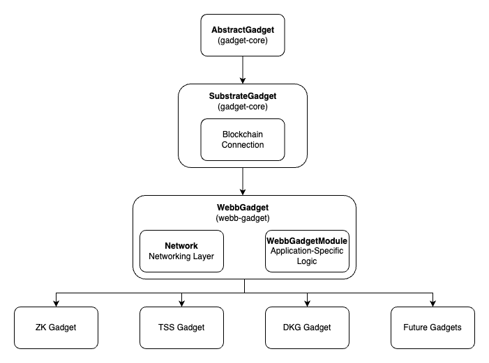

# Gadget

## Design

The core library is `gadget-core`. The core library allows gadgets to hold standardization of use across different blockchains. The core library is the base of all gadgets, and expects to receive `FinalityNotifications` and `BlockImportNotifications`.

Once such blockchain is a substrate blockchain. This is where `webb-gadget` comes into play. The `webb-gadget` is the `core-gadget` endowed with a connection to a substrate blockchain, a networking layer to communicate with other gadgets, and a `WebbGadgetModule` that has application-specific logic. 

Since `webb-gadget` allows varying connections to a substrate blockchain and differing network layers, we can thus design above it the `zk-gadget` and `tss-gadget`. These gadgets are endowed with the same functionalities as the `webb-gadget` but with a (potentially) different blockchain connection, networking layer, and application-specific logic.
