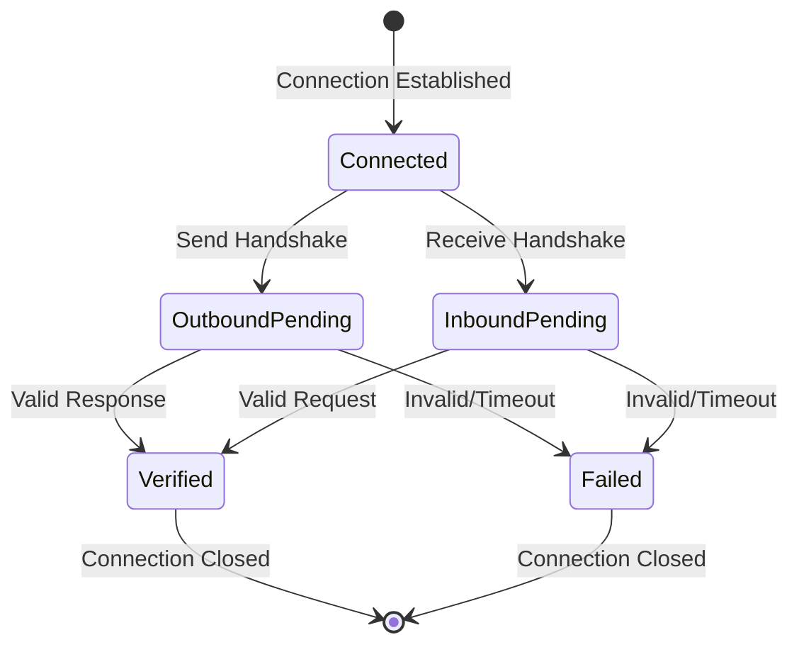
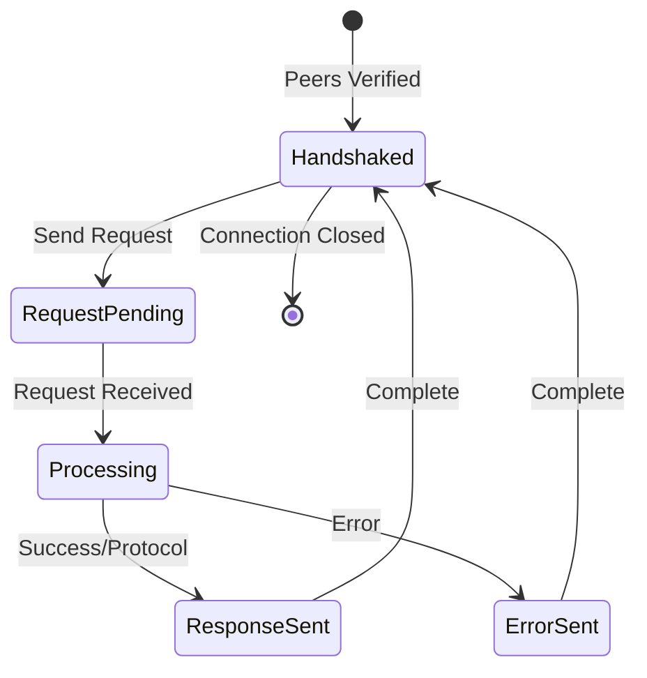

# Networking Protocol Documentation

This document outlines the key protocols used in the networking layer.

## Handshake Protocol

The handshake protocol ensures mutual authentication between peers before allowing protocol messages.

```mermaid
sequenceDiagram
    participant A as Peer A
    participant B as Peer B

    Note over A,B: Connection Established

    A->>B: HandshakeRequest {
        public_key: A_pub,
        signature: sign(B_peer_id)
    }

    Note over B: Verify A's signature
    Note over B: Store A's public key

    B->>A: HandshakeResponse {
        public_key: B_pub,
        signature: sign(A_peer_id)
    }

    Note over A: Verify B's signature
    Note over A: Store B's public key

    Note over A,B: Both peers verified
    Note over A,B: Protocol messages allowed
```

### Handshake States



## Blueprint Protocol Instance Request/Response

After handshake completion, peers can exchange protocol messages.

```mermaid
sequenceDiagram
    participant A as Peer A (Verified)
    participant B as Peer B (Verified)

    Note over A,B: Handshake Completed

    A->>B: InstanceMessageRequest::Protocol {
        protocol: String,
        payload: Vec<u8>,
        metadata: Option<Vec<u8>>
    }

    alt Success Response
        B->>A: InstanceMessageResponse::Success {
            data: Option<Vec<u8>>
        }
    else Protocol Response
        B->>A: InstanceMessageResponse::Protocol {
            data: Vec<u8>
        }
    else Error Response
        B->>A: InstanceMessageResponse::Error {
            code: u16,
            message: String
        }
    end
```

### Message Flow States



## Protocol Details

### Handshake Protocol

- Initiated on first connection
- Mutual authentication using public key cryptography
- Signatures verify peer identity
- Timeouts after 30 seconds
- Handles concurrent handshakes gracefully

### Blueprint Protocol

- Requires completed handshake
- Supports protocol-specific messages
- Includes metadata for routing/handling
- Error responses for protocol violations
- Supports both direct and broadcast messaging

### Security Features

- Peer verification before message acceptance
- Signature verification for handshakes
- Banned peer tracking
- Connection limits
- Protocol version validation
