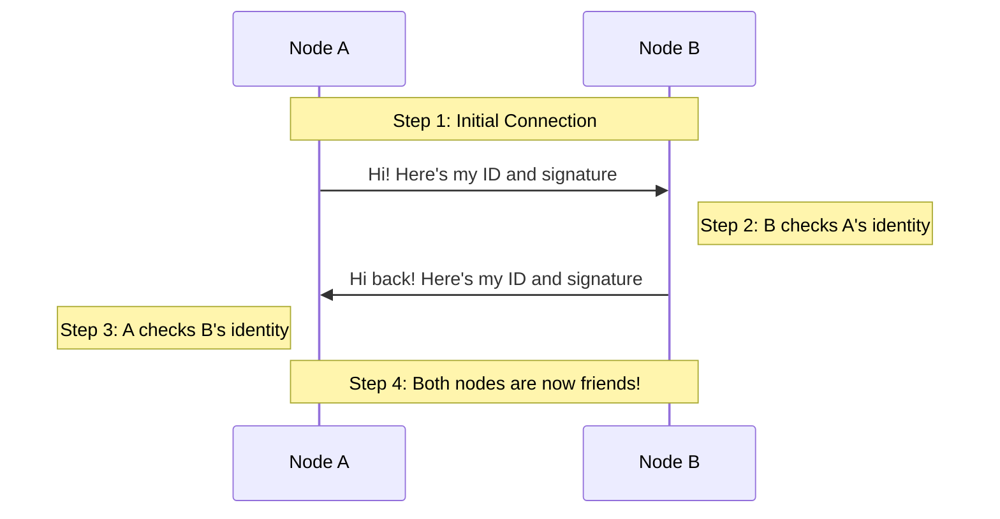
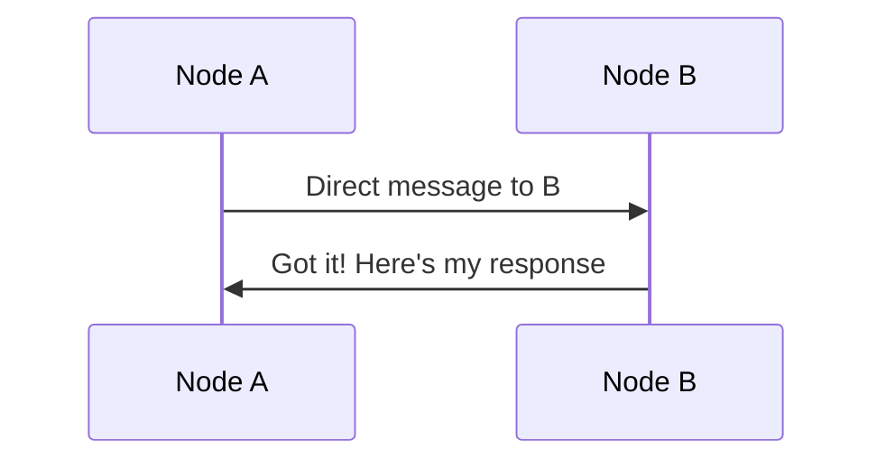
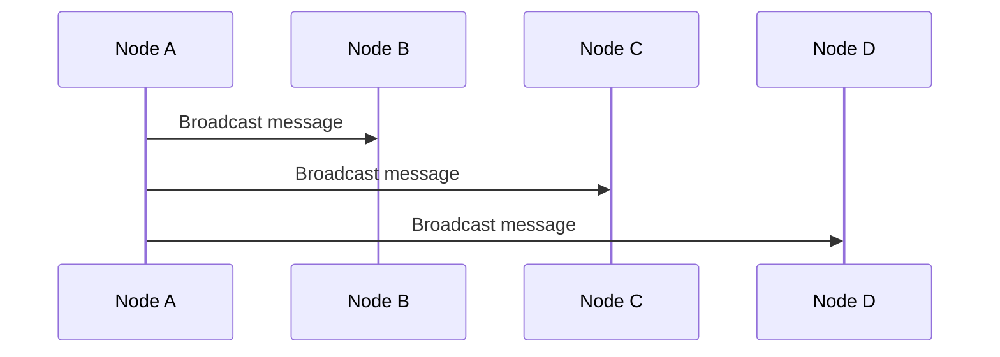

# Networking Protocol Documentation

This document explains how nodes in our network talk to each other securely.

## 1. The Handshake Protocol

Before two nodes can exchange messages, they must verify each other's identity. This happens in a process called "handshaking".

### How the Handshake Works

1. **Initial Connection**

   - Two nodes connect over the network
   - Neither trusts the other yet

2. **Identity Verification**
   - Each node has:
     - A unique ID
     - A public key
     - A private key
3. **The Handshake Steps**
   - Node A sends: ID + timestamp + signature
   - Node B verifies:
     - Is the timestamp recent?
     - Is A's ID valid?
     - Is A's signature correct?
     - Is A allowed to connect?
   - Node B responds with its own ID + timestamp + signature
   - Node A performs the same checks
4. **Success!**
   - Both nodes now trust each other
   - They can start sending messages
   - The connection is secure

## 2. Sending Messages

After the handshake, nodes can send two types of messages:

### Direct P2P Messages

- Sent to one specific node
- Guaranteed delivery attempt
- Node must be verified first
- Gets a response back

### Broadcast Gossip Messages

- Sent to all connected nodes
- Best-effort delivery (might miss some)
- Uses gossip protocol (nodes help spread the message)
- No response expected

## 3. Security Features

We keep everything secure by:

- ✓ Checking identities before accepting messages
- ✓ Verifying signatures on all handshakes
- ✓ Using timestamps to prevent replay attacks
- ✓ Tracking and banning misbehaving nodes
- ✓ Limiting connections to prevent overload
- ✓ Validating protocol versions match

## 4. Error Handling

Things don't always go perfectly! We handle problems like:

- ❌ Invalid signatures
- ❌ Expired timestamps
- ❌ Unknown nodes
- ❌ Network timeouts
- ❌ Protocol mismatches

Each error gets a specific response so nodes know what went wrong.

## 5. Quick Reference

### Message Types

- **Handshake**: Verify identity
- **Direct**: One-to-one message
- **Broadcast**: One-to-many message
- **Response**: Reply to direct message
- **Error**: Something went wrong

### Timeouts

- Handshake: 30 seconds
- Message delivery: Configurable
- Connection retry: Automatic with backoff
