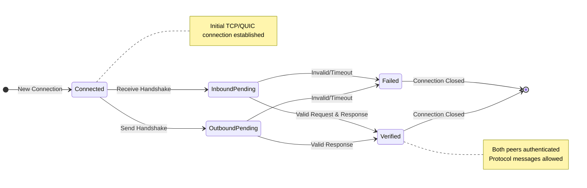
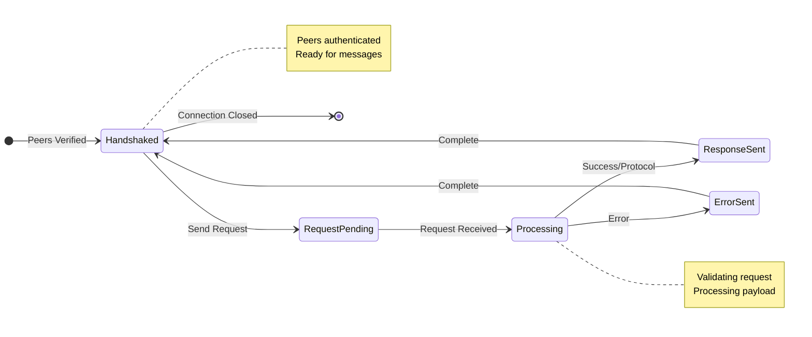

# Networking Protocol Documentation

This document outlines the key protocols used in the networking layer.

## Handshake Protocol

The handshake protocol ensures mutual authentication between peers before allowing protocol messages.

```mermaid
sequenceDiagram
    participant A as Peer A
    participant B as Peer B

    Note over A,B: Initial TCP/QUIC Connection Established

    Note over A: Generate signature of B's peer ID
    A->>+B: HandshakeRequest {
        public_key: A_pub,
        signature: sign(B_peer_id)
    }

    Note over B: 1. Verify A's signature<br/>2. Store A's public key

    Note over B: Generate signature of A's peer ID
    B-->>-A: HandshakeResponse {
        public_key: B_pub,
        signature: sign(A_peer_id)
    }

    Note over A: 1. Verify B's signature<br/>2. Store B's public key

    Note over A,B: ✓ Handshake Complete
    Note over A,B: ✓ Protocol Messages Allowed
```

### Handshake States



## Protocol Message Exchange

After handshake completion, peers can exchange protocol messages through direct P2P or broadcast channels.

```mermaid
sequenceDiagram
    participant A as Peer A (Verified)
    participant B as Peer B (Verified)

    Note over A,B: ✓ Handshake Completed

    A->>+B: InstanceMessageRequest {
        protocol: String,
        payload: Vec<u8>,
        metadata: Option<Vec<u8>>
    }

    alt Success Case
        B-->>-A: InstanceMessageResponse::Success {
            data: Option<Vec<u8>>
        }
    else Protocol Response
        B-->>-A: InstanceMessageResponse::Protocol {
            data: Vec<u8>
        }
    else Error Case
        B-->>-A: InstanceMessageResponse::Error {
            code: u16,
            message: String
        }
    end
```

### Message Flow States



## Protocol Details

### Handshake Protocol

- Initiated on first connection
- Mutual authentication using public key cryptography
- Signatures verify peer identity
- Timeouts after 30 seconds
- Handles concurrent handshakes gracefully

### Protocol Message Types

- Direct P2P messages:
  - Targeted to specific peer
  - Requires peer verification
  - Guaranteed delivery attempt
- Broadcast messages:
  - Sent to all peers
  - Uses gossipsub protocol
  - Best-effort delivery

### Security Features

- Peer verification before message acceptance
- Signature verification for handshakes
- Banned peer tracking
- Connection limits
- Protocol version validation
